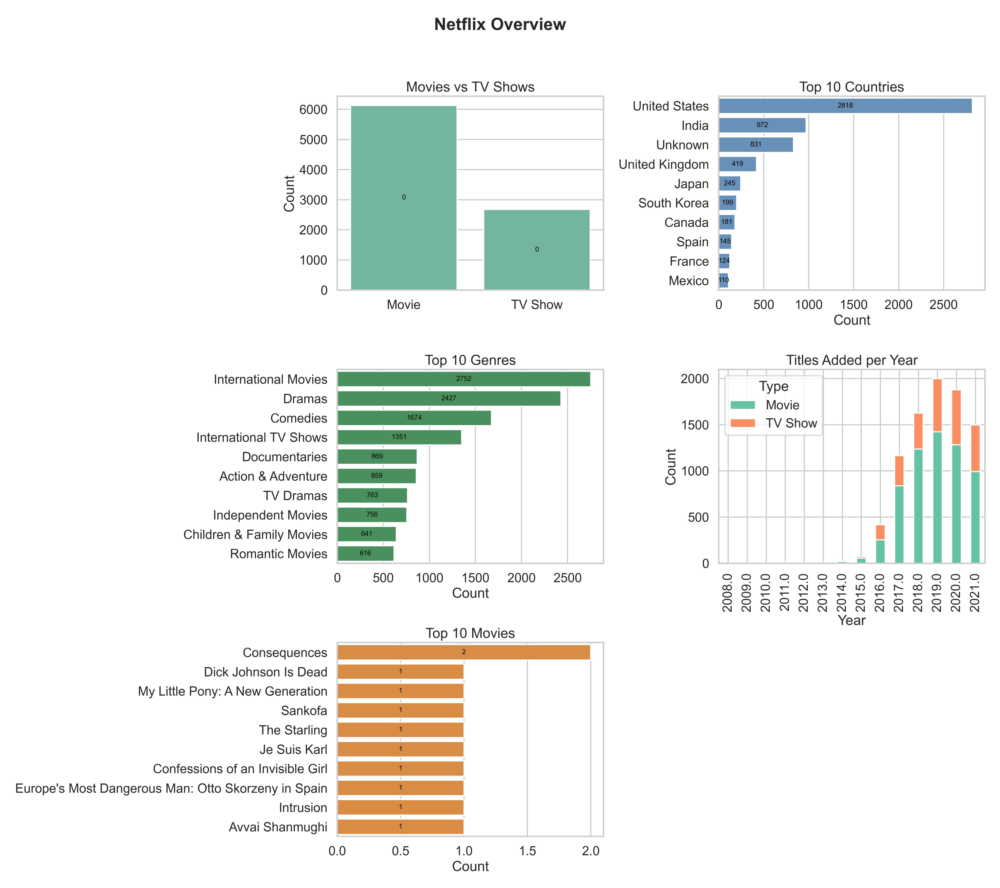

# Netflix Data Analysis

I built this project to practice **data cleaning, exploratory analysis, and visualization** using a real-world dataset.  

---

## Dataset

- File: `netflix_titles.csv`
- Source: Public Netflix dataset
- Main fields used:
  - `title`
  - `type`
  - `country`
  - `date_added`
  - `listed_in` (genres)

Missing values are handled by filling them with `"Unknown"` or `"Not Available"` to keep the analysis consistent.

---

## What I Analyzed

- **Movies vs TV Shows**  
  Overall distribution of Netflix content types.

- **Top 10 Countries**  
  Countries that produce the most Netflix titles.

- **Top 10 Genres**  
  Most common genres available on Netflix.

- **Titles Added per Year**  
  Growth of Netflix’s content library over time (Movies vs TV Shows).

- **Top 10 Movies**  
  Most frequently appearing movie titles in the dataset.

All visualizations are combined into one overview image for presentation purposes.

---

## Visualization



- All charts are placed on a single page
- Consistent color palette
- Values shown directly on charts for readability

---

## Tools Used

- Python 3
- pandas
- matplotlib
- seaborn

---

## How to Run

Install required libraries:

```bash

pip install pandas matplotlib seaborn
